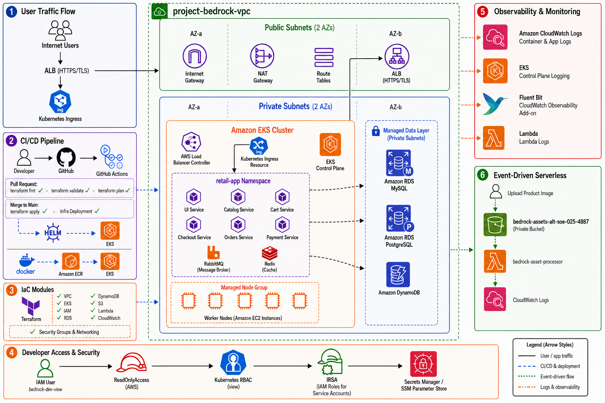

# Architecture Overview

Project Bedrock runs the AWS Retail Store sample application on Amazon EKS with managed AWS data services, CI/CD automation, observability, and a serverless asset-processing path.

## Request Flow

1. Users access the public AWS Application Load Balancer.
2. The ALB forwards requests to the Kubernetes `ui` Ingress in the `retail-app` namespace.
3. The UI routes traffic to the catalog, carts, checkout, and orders services.
4. Catalog data is stored in Amazon RDS for MySQL.
5. Orders data is stored in Amazon RDS for PostgreSQL.
6. Cart data is stored in DynamoDB through IRSA-enabled pod credentials.
7. Redis and RabbitMQ run in-cluster because the assignment allows brokers to remain as pods.

## Network Layout

| Layer | Implementation |
|-------|----------------|
| VPC | `project-bedrock-vpc`, `10.0.0.0/16` |
| Public subnets | `10.0.1.0/24`, `10.0.2.0/24` for ALB and NAT Gateway |
| Private subnets | `10.0.10.0/24`, `10.0.11.0/24` for EKS nodes and RDS |
| Cluster | `project-bedrock-cluster` |
| Node group | Managed node group, `t3.small`, desired size 3 |
| Namespace | `retail-app` |

## Managed Data Layer

| Application component | Backing service | Security posture |
|-----------------------|-----------------|------------------|
| Catalog | RDS MySQL 8.0 | Private subnet, encrypted storage, node SG ingress only |
| Orders | RDS PostgreSQL 15 | Private subnet, encrypted storage, node SG ingress only |
| Carts | DynamoDB | IRSA policy scoped to carts table |
| Checkout cache | Redis pod | In-cluster |
| Orders messaging | RabbitMQ pod | In-cluster |

Database credentials are generated by Terraform, stored in AWS Secrets Manager, and injected into Kubernetes as secrets for the Helm deployment.

## Security

- `bedrock-dev-view` has AWS `ReadOnlyAccess`, S3 `PutObject` access only for the assets bucket, EKS view access, and Kubernetes `view` RBAC.
- GitHub Actions uses OIDC and assumes the `project-bedrock-cluster-github-actions` role.
- EKS cluster creator access is explicit and stable; it does not depend on whichever identity runs Terraform.
- RDS instances are private and only accept inbound database traffic from the EKS node security group.
- S3 public access is blocked for the assets bucket.

## Observability

| Source | CloudWatch destination |
|--------|------------------------|
| EKS control plane | `/aws/eks/project-bedrock-cluster/cluster` |
| Container and dataplane logs | `/aws/containerinsights/project-bedrock-cluster/*` |
| Lambda | `/aws/lambda/bedrock-asset-processor` |

## Event-Driven Extension

The `bedrock-assets-alt-soe-025-4887` S3 bucket emits `ObjectCreated` events to the `bedrock-asset-processor` Lambda function. The Lambda logs the uploaded object key to CloudWatch.

## Advanced Networking (HTTPS)

The chart and Terraform configuration support ALB HTTPS termination through ACM in two modes:

- Trusted certificate mode: set GitHub repository variable `RETAIL_STORE_HOST` and GitHub Actions secret `ALB_CERTIFICATE_ARN` before applying.
- Free-tier `nip.io` fallback: run the Terraform workflow manually with `action=apply` and `enable_nipio_tls=true`.

The `nip.io` fallback deploys the HTTP ALB first, resolves one current ALB IPv4 address, creates a hostname such as `retail-store-1-2-3-4.nip.io`, imports a 30-day self-signed certificate into ACM, and re-applies the Ingress with HTTPS listener and redirect annotations.

This satisfies the ALB-side TLS termination and ACM integration path without Route 53 or a paid domain. It is not trusted browser HTTPS: the certificate is self-signed, and the `nip.io` hostname depends on the selected current ALB IP.
